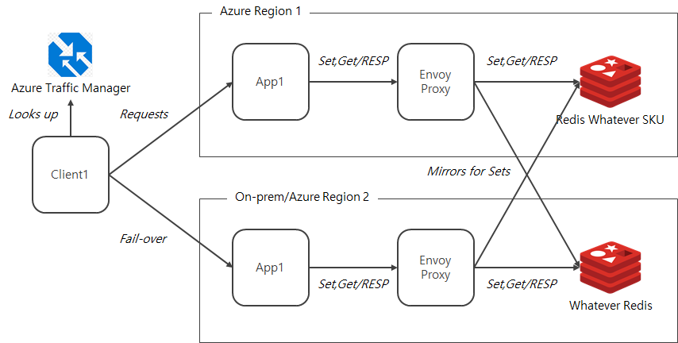
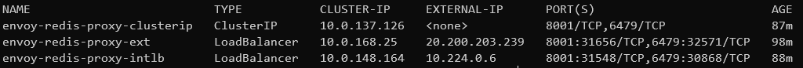

# envoy-proxy-config
Envoy proxy configs on Azure environment


Configuration looks like this



## How to run

1. Config Azure Cache for Redis by updating `iac/bicep/services-main.bicep`

```
param location1 string = 'koreacentral'
param location2 string = 'koreasouth'

param redis1 string = 'redis-krc-001'
param redis2 string = 'redis-krs-001'

module stgRedis1 'services/redis-template.bicep' = {
  name: 'create-redis1'
  params: {
    gLocation: location1
    redis_name: redis1
  }
}

module stgRedis2 'services/redis-template.bicep' = {
  name: 'create-redis2'
  params: {
    gLocation: location2
    redis_name: redis2
  }
}
```

Update `location1`, `location2` and `redis1`, `redis2`

2. Provision Azure Cache for Redis resources 

```
export RESOURCE_GROUP={your resource group name}

az deployment group create \
 -g $RESOURCE_GROUP \
 -f iac/bicep/services-main.bicep
```

3. Running envoy-redis-proxy locally

After install docker and start by running `service docker start`

```
sudo docker pull nudbeach/envoy-redis-proxy:latest

sudo docker run -it --name envoy-redis-proxy \
 -p 6479:6479 -p 8001:8001 \
 -e SSL=1 -e DEBUG=1 -e CONCURRENCY=5 \
 -e ADMIN_PORT=8001 \
 -e LISTEN_PORT=6479 \
 -e PREFIX_STRING=$ \
 -e REDIS1_HOST={your redis1 name}.redis.cache.windows.net \
 -e REDIS1_PORT={your redis1 port, 6380 for TLS} \
 -e REDIS1_AUTH={your redis1 access key} \
 -e REDIS2_HOST={your redis2 name}.redis.cache.windows.net \
 -e REDIS2_PORT={your redis2 port, 6380 for TLS} \
 -e REDIS2_AUTH={your redis2 access key} \
 envoy-redis-proxy:latest 
``` 

`envoy-redis-proxy`, the container image can be found from [here](https://hub.docker.com/repository/docker/nudbeach/envoy-redis-proxy)

4. Testing locally

```
redis-cli -h localhost -p 6479
```

No AUTH's required for downstream

Open http://localhost:8001 for admin page

Use prefix `$` (dollar sign) for the keys to mirror the traffic to REDIS2

```
set $a a1
```

Prefix'es removed when it's stored

5. Deploying to AKS

Config `redis/aks-deployment.yml` with your resources

```
apiVersion: apps/v1
kind: Deployment
spec:
  template:
    spec:
      containers:
        env:
        - name: "SSL"
          value: "1"
        - name: "DEBUG"
          value: "1"
        - name: "CONCURRENCY"
          value: "5"
        - name: "ADMIN_PORT"
          value: "8001"
        - name: "LISTEN_PORT"
          value: "6479"
        - name: "PREFIX_STRING"
          value: "$"
        - name: "REDIS1_HOST"
          value: "{your redis1 host}"
        - name: "REDIS1_PORT"
          value: "{your redis1 port on TLS, 6380}"
        - name: "REDIS1_AUTH"
          value: "{your redis1 acess key}"
        - name: "REDIS2_HOST"
          value: "{your redis2 host}"
        - name: "REDIS2_PORT"
          value: "{your redis2 port on TLS, 6380}"
        - name: "REDIS2_AUTH"
          value: "{your redis2 acess key}"
```

Deploy them to your AKS

```
kubectl create -f redis/aks-namespace.yml

kubectl apply --namespace=envoy-redis-proxy -f redis/aks-deployment.yml

kubectl apply --namespace=envoy-redis-proxy -f redis/aks-service-ext.yml

kubectl apply --namespace=envoy-redis-proxy -f redis/aks-service-clusterip.yml

kubectl apply --namespace=envoy-redis-proxy -f redis/aks-service-intlb.yml
```

6. Testing it over Envoy on AKS

Make sure the services bound to the Envoy proxy

```
kubectl get service --namespace=envoy-redis-proxy
```

You'll see it like this



Run `redis-cli` 

```
redis-cli -h {external ip} -p 6479
```

## How to config

In the `redis/envoy-conf.yml.template`

```
static_resources:
  listeners:
  - name: redis_listener
    address:
      socket_address:
        address: 0.0.0.0
        port_value: ${LISTEN_PORT}
    ignore_global_conn_limit: true
    filter_chains:
    - filters:
      - name: envoy.filters.network.redis_proxy
        typed_config:
          "@type": type.googleapis.com/envoy.extensions.filters.network.redis_proxy.v3.RedisProxy
          stat_prefix: egress_redis
          settings:
            op_timeout: 5s
          prefix_routes:
           routes:
             - prefix: "${PREFIX_STRING}"
               cluster: cluster1
               remove_prefix: true
               request_mirror_policy:
                 cluster: cluster2
                 exclude_read_commands: True 
           catch_all_route: 
             cluster: cluster1
```

`prefix_routes` defines the routing rule with traffic mirroring

- requests with keys starts with prefix goes to both clusters 1 and 2
- except for reads, all reads goes to cluser 1
- rest of all requests goes to cluster 1

Be mindful of connection configs for both clusters

```
    connect_timeout: 0.5s
    dns_refresh_rate: 300 s
    health_checks:
      - timeout: 1s
        interval: 60s
        interval_jitter: 1s
        unhealthy_threshold: 3
        healthy_threshold: 3
        tcp_health_check: {}
    circuit_breakers:
      thresholds:
        priority: 1
        max_connections: 10
        max_pending_requests: 10
        max_requests: 100
        max_retries: 3
        max_connection_pools: 20        
    preconnect_policy:
      per_upstream_preconnect_ratio: 1.2
      predictive_preconnect_ratio: 2
    transport_socket: 
      name: envoy.transport_sockets.tls
      typed_config:
        "@type": type.googleapis.com/envoy.extensions.transport_sockets.tls.v3.UpstreamTlsContext
        common_tls_context:
          validation_context:
            trusted_ca:
              filename: /etc/ssl/certs/ca-certificates.crt 

```

Some efforts are required to fine tune these values based upon your environment, Redis config and SKUs

If you want to make some changes on these, you need to rebuild the container images